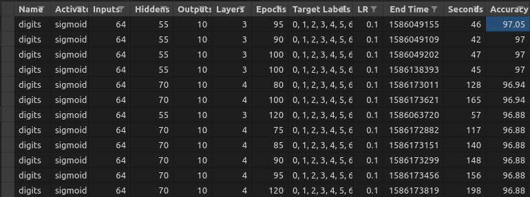

# Gophernet

The purpose of this project is to learn about neural nets. Gophernet is a fully connected multi-layer network with 
configurable network parameters. There are two datasets used here. One is handwritten digits 0 to 9. The data is 
represented as 64 values representing an 8x8 bitmap of a character. Each value ranges from 0..16 and represents an 
intensity. A second detaset, fishing, gives information about whether it is a good day to fish.

## Implementation

### Preparation

The cmd folder contains code used in the normalization of the data. This commandline tool is simple 
and hard codes a couple values specific to these data sets since a fully multi-purpose data formatter 
would have been beyond the scope of this project. Numbers are normalized and targets are split out into 
multiple columns.

The fishing dataset required assigning numbers to the categorical inputs. I didn't want to simply turn every 
value into a 0 or 1 since I suspected that the order of the values (e.g.) might still contain information 
useful to the network. Therefore, I assigned values like 1, 2, and 3 to "Warm", "Moderate", and "Cold" and then
normalized these numbers per input.

### Third party software and reference

- Gonum: This is my one third party dependency. Gonum is primarily a matrix math library, and it contains similar 
  functionality to Python's numpy. 
- Blog post [How to build a simple artificial network with Go](https://sausheong.github.io/posts/how-to-build-a-simple-artificial-neural-network-with-go/)
  helped my understanding of the matrix functions in Gonum. I used the same initialization dimensions in matrix.go, but 
  the rest of my design diverged from his advice in structure due to my supporting n numbers of layers as well as in features 
  since his demo did not include parameters to change activation functions, epochs, or other settings and didn't suggest any 
  way of analyzing the results for fine-tuning.
  
### Formulas

#### Activation

My activation functions implement an activator interface, allowing use of different functions which are chosen by commandline 
parameters:

```
type Activator interface {
	Activate(i, j int, sum float64) float64
	Deactivate(m mat.Matrix) mat.Matrix
	fmt.Stringer
}
```

Sigmoid implements this interface as follows:
```
type Sigmoid struct{}

func (s Sigmoid) Activate(i, j int, sum float64) float64 {
	return 1.0 / (1.0 + math.Exp(-sum))
}

func (s Sigmoid) Deactivate(matrix mat.Matrix) mat.Matrix {
	rows, _ := matrix.Dims()
	o := make([]float64, rows)
	for i := range o {
		o[i] = 1
	}
	ones := mat.NewDense(rows, 1, o)
	return multiply(matrix, subtract(ones, matrix))
}

func (s Sigmoid) String() string {
	return "sigmoid"
}
```

The primary logic for back propagation, feeding forward, and prediction follows:

```
func (net *Network) backpropagate(targetData []float64, finalOutputs mat.Matrix) {
	for i := net.lastIndex(); i > 0; i-- {
		// find errors
		if i == net.lastIndex() {
			// network error
			targets := mat.NewDense(len(targetData), 1, targetData)
			net.errors[len(net.errors)-1] = subtract(targets, finalOutputs)
		} else {
			net.errors[i] = dot(net.weights[i].T(), net.errors[i+1])
		}
		net.weights[i-1] = add(net.weights[i-1],
			scale(net.config.LearningRate,
				dot(multiply(net.errors[i], net.config.Activator.Deactivate(net.layers[i])),
					net.layers[i-1].T()))).(*mat.Dense)
	}
}

func (net *Network) feedForward(inputData []float64) {
	// first layer
	net.layers[0] = mat.NewDense(len(inputData), 1, inputData)
	net.weightedSums[0] = dot(net.weights[0], net.layers[0])
	for i := range net.layers {
		if i == 0 {
			continue
		}
		net.layers[i] = apply(net.config.Activator.Activate, net.weightedSums[i-1])
		// don't get weighted sums if final output
		if i != len(net.layers)-1 {
			net.weightedSums[i] = dot(net.weights[i], net.layers[i])
		}
	}
}

func (net Network) Predict(inputData []float64) string {
	// feedforward
	net.feedForward(inputData)

	bestOutputIndex := 0
	highest := 0.0
	outputs := net.layers[net.lastIndex()]
	for i := 0; i < net.config.OutputNum; i++ {
		if outputs.At(i, 0) > highest {
			bestOutputIndex = i
			highest = outputs.At(i, 0)
		}
	}

	return net.labelFor(bestOutputIndex)
}
```

Training a single epoch then merely calls to feedforward and backpropagate:

```
func (net *Network) trainOne(inputData []float64, targetData []float64) {
	net.feedForward(inputData)
	finalOutputs := net.layers[net.lastIndex()]

	net.backpropagate(targetData, finalOutputs)
}
```

## Learning

### Experiments

- My primary method of experimenting was running 830 training sessions with varying parameters and examining the 
  success of the training as I went.
- Multiple layer support increased the complexity of the application but made it more flexible for complicated problems.
  In this case, the problem wasn't more complicated than what one can solve in three layers (one hidden). Therefore, the 
  additional layer support was not helpful here.
- I attempted to support alternative activation functions such as tanh. I was unable to get results better than random 
  chance, which I suspect means I need to find a way to scale the final outputs correctly, which is mentioned in another 
  [project](https://github.com/vstoianovici/NNgoClassify) doing the same type of thing, but I was unable to find literature 
  discussing scaling of an output while using tanh.

## Results

### Accuracy

The highest accuracy I was able to achieve was **97.05%** using a sigmoid activation function, a 64-55-10 network, a 
learning rate of .1, 3 layers, and 95 epochs. This took 46 seconds to train. A couple 4 layer settings allowed me to get 
close to but not beat this result. I was able to train a 94% accurate network in a second (sigmoid, 64-15-10, 9 epochs), 
but since you train once and then are able to reuse the final weights to predict, the shorter training time is not very 
important.  

### Analysis

After running training sessions and saving the data for 700 combinations of parameters, I looked at the results in a 
spreadsheet application. The results are stored in CSV, so they are easy to sort and filter. After determining that the 
learning rate .1, 55 nodes per hidden layer, and roughly 100 epochs were optimal for this training set, I tried another 
130 parameter combinations. However, I did not find any combinations that were able to beat 97.05% accuracy.



### Output

Terminal output mostly indicates how many epochs have been accomplished. The main details are in the csv file. To run, 
type `./gophernet train digits -layers=4 -hidden=55 -epochs=100 -rate=.1`. The activator defaults to sigmoid but can be 
changed with the `-activator` flag and the learning rate can be adjusted with `-rate`.

To query a dataset, you can use `./gophernet predict fishing -query=0,1,0,0` and it will return a result using the 
target labels (yes,no for fishing) recorded in the csv file. You don't need to select a specific session as the predict 
command will simply look for the session of the requested dataset with the highest accuracy and load those weights from 
the out folder. Output of the predict command looks like this: `Prediction: yes`.